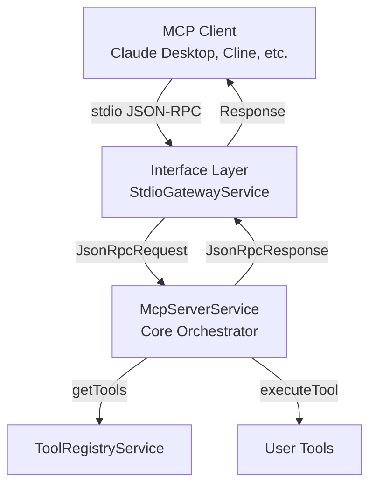

# EasyMCP Framework

A NestJS-based framework for building standard Model Context Protocol (MCP) servers with tool execution via JSON-RPC 2.0.

## Description

EasyMCP simplifies the creation of MCP (Model Context Protocol) servers by providing a clean, type-safe framework that:

- **Standard MCP Protocol**: Implements the Model Context Protocol specification with JSON-RPC 2.0 over stdio
- **Tool Execution**: Register and execute tools that external LLM agents can discover and call
- **Type Safety**: Full TypeScript support with comprehensive type definitions
- **Simple Configuration**: Minimal setup required - just define your tools and run

## Installation

```bash
npm install easy-mcp-nest
# or
pnpm add easy-mcp-nest
# or
yarn add easy-mcp-nest
```

### Peer Dependencies

EasyMCP requires the following peer dependencies to be installed:

- `@nestjs/common` ^11.0.1
- `@nestjs/core` ^11.0.1
- `@nestjs/platform-express` ^11.0.1

Install them with:

```bash
npm install @nestjs/common@^11.0.1 @nestjs/core@^11.0.1 @nestjs/platform-express@^11.0.1
```

## Quick Start

```typescript
import { EasyMCP, McpConfig } from 'easy-mcp-nest';

// Define your tools
async function getUser(args: { userId: string }): Promise<string> {
  // Your tool logic here
  const user = await fetchUser(args.userId);
  return JSON.stringify(user);
}

// Configure EasyMCP
const config: McpConfig = {
  tools: [
    {
      name: 'getUser',
      description: 'Retrieves user details by ID',
      function: getUser,
      inputSchema: {
        type: 'OBJECT',
        properties: {
          userId: {
            type: 'STRING',
            description: 'The unique ID of the user',
          },
        },
        required: ['userId'],
      },
    },
  ],
};

// Initialize and run
async function bootstrap() {
  await EasyMCP.initialize(config);
  await EasyMCP.run();
}

bootstrap();
```

## Configuration

### McpConfig

The main configuration object passed to `EasyMCP.initialize()`:

```typescript
interface McpConfig {
  tools: ToolRegistrationInput[];
  serverInfo?: ServerInfo;
}
```

### ToolRegistrationInput

Each tool must implement:

```typescript
interface ToolRegistrationInput {
  name: string;
  description: string;
  function: (args: Record<string, any>) => Promise<any>;
  inputSchema: {
    type: 'OBJECT';
    properties: Record<string, {
      type: 'STRING' | 'NUMBER' | 'INTEGER' | 'BOOLEAN' | 'ARRAY' | 'OBJECT';
      description: string;
      enum?: string[];
    }>;
    required?: string[];
  };
}
```

### ServerInfo (Optional)

Optional server information for MCP initialize response:

```typescript
interface ServerInfo {
  name: string;
  version: string;
}
```

### Example Tool

```typescript
async function searchDatabase(args: { query: string; limit?: number }): Promise<string> {
  const results = await db.search(args.query, args.limit || 10);
  return JSON.stringify(results);
}

const searchTool: ToolRegistrationInput = {
  name: 'searchDatabase',
  description: 'Searches the database for matching records',
  function: searchDatabase,
  inputSchema: {
    type: 'OBJECT',
    properties: {
      query: {
        type: 'STRING',
        description: 'The search query',
      },
      limit: {
        type: 'INTEGER',
        description: 'Maximum number of results to return',
      },
    },
    required: ['query'],
  },
};
```

## API Reference

### EasyMCP Class

#### `static initialize(config: McpConfig): Promise<void>`

Initializes the EasyMCP framework with the provided configuration. Must be called before `run()`.

#### `static run(): Promise<void>`

Starts the EasyMCP server and begins listening for JSON-RPC requests via stdio.

#### `static getService<T>(token: string | symbol): T`

Retrieves a service from the NestJS application context. Useful for advanced use cases.

#### `static shutdown(): Promise<void>`

Gracefully shuts down the EasyMCP framework, closing the NestJS application context and cleaning up resources. Should be called when the application is terminating (e.g., on SIGTERM, SIGINT signals).

```typescript
// Example: Handle graceful shutdown
process.on('SIGTERM', async () => {
  await EasyMCP.shutdown();
  process.exit(0);
});

process.on('SIGINT', async () => {
  await EasyMCP.shutdown();
  process.exit(0);
});
```

### Types

- `McpConfig` - Main configuration interface
- `ToolRegistrationInput` - Tool definition interface
- `ServerInfo` - Optional server information
- `JsonRpcRequest`, `JsonRpcResponse`, `JsonRpcError` - JSON-RPC 2.0 types
- `JsonRpcErrorCode` - JSON-RPC 2.0 error code enum
- `InitializeParams`, `InitializeResult` - MCP initialize types
- `ListToolsResult`, `McpTool` - MCP tools types
- `CallToolParams`, `CallToolResult` - MCP tool call types
- `ToolDefinition`, `ToolParameter`, `ToolFunction` - Tool interfaces
- `IInterfaceLayer` - Interface layer interface
- `McpErrorCode` - MCP error code enum
- `VERSION`, `PACKAGE_NAME`, `getVersion()`, `getPackageName()` - Version information utilities
- `INTERFACE_LAYER_TOKEN` - Token for accessing the interface layer (advanced use cases)

## Architecture

EasyMCP uses a simplified architecture for standard MCP servers:

1. **Interface Layer**: Handles JSON-RPC 2.0 communication over stdio
2. **Core Layer**: Implements MCP protocol methods (initialize, tools/list, tools/call)
3. **Tool Registry**: Manages tool registration and execution

### Architecture Diagram



## MCP Protocol Compliance

EasyMCP implements the standard Model Context Protocol (MCP) specification version **2024-11-05**.

### Protocol Version

- **Supported Version**: `2024-11-05`
- **Validation**: The framework validates that clients use the supported protocol version during initialization
- **Error Handling**: Unsupported protocol versions are rejected with a clear error message

### Supported Methods

EasyMCP implements the following MCP protocol methods:

- **`initialize`** - Server/client handshake, returns server capabilities and protocol version
  - Validates client protocol version
  - Returns server capabilities (currently supports tools)
  - Returns server information (name and version)
  
- **`tools/list`** - Returns all registered tools with their JSON Schema definitions
  - Returns array of tool definitions in MCP format
  - Each tool includes name, description, and inputSchema
  
- **`tools/call`** - Executes a tool with provided arguments and returns the result
  - Validates tool arguments against schema
  - Executes tool function
  - Returns result in MCP content format
  - Handles errors according to MCP error code specification

### Error Codes

EasyMCP uses standard JSON-RPC 2.0 and MCP error codes:

- `-32700` - Parse error
- `-32600` - Invalid request
- `-32601` - Method not found
- `-32602` - Invalid params
- `-32603` - Internal error
- `-32001` - Tool not found (MCP-specific)
- `-32002` - Tool execution error (MCP-specific)

### Transport

The server communicates via JSON-RPC 2.0 over stdio (standard input/output), which is the standard transport for MCP servers. This allows the server to be used with MCP clients like Claude Desktop, Cursor, Cline, and other MCP-compatible tools.

**Default Mode: Newline-Delimited JSON**

By default, the server uses newline-delimited JSON (one JSON-RPC message per line) for maximum compatibility with MCP clients. This mode works seamlessly with Cursor, Claude Desktop, and other popular MCP clients.

**Content-Length Framing Mode (Optional)**

For strict MCP protocol compliance with Content-Length framing, set the environment variable:
```bash
MCP_USE_CONTENT_LENGTH=1
```

This enables the MCP-specified Content-Length header format, which some clients may not parse correctly.

### Limitations

- **Transport**: Currently only stdio transport is supported. WebSocket and HTTP transports are not available.
- **Capabilities**: Only tools capability is implemented. Resources and prompts capabilities are not yet supported.
- **Protocol Version**: Only protocol version 2024-11-05 is supported. Older or newer versions will be rejected.

For more information on testing EasyMCP with real MCP clients, see [Integration Testing Guide](docs/INTEGRATION_TESTING.md).

## Error Handling

EasyMCP provides comprehensive error handling with custom error classes and clear error messages.

### Error Classes

- **`EasyMcpError`** - Base error class for all framework errors
- **`ConfigurationError`** - Configuration validation errors (thrown during `initialize()`)
- **`ToolExecutionError`** - Tool execution failures (wrapped and returned as MCP error)
- **`ToolNotFoundError`** - Tool not found in registry (returned as MCP error code -32001)

### Error Handling Examples

```typescript
import { 
  EasyMCP, 
  ConfigurationError, 
  ToolExecutionError, 
  ToolNotFoundError
} from 'easy-mcp-nest';

// Configuration errors - caught during initialization
try {
  await EasyMCP.initialize(config);
} catch (error) {
  if (error instanceof ConfigurationError) {
    console.error('Configuration error:', error.message);
    // Example: "Tool 'myTool': name must be a non-empty string"
  }
}

// Tool execution errors - handled automatically by MCP protocol
// When a tool throws an error, it's automatically converted to an MCP error response
// The error is logged to stderr and returned to the client with error code -32002
```

### Common Error Scenarios

**Configuration Errors:**
- Missing required fields (tools array, tool name, description, etc.)
- Invalid tool schemas (unsupported types, missing properties)
- Invalid serverInfo format

**Tool Execution Errors:**
- Tool function throws an exception → Returns MCP error code -32002
- Tool not found → Returns MCP error code -32001
- Invalid tool arguments → Returns JSON-RPC error code -32602 (Invalid Params)

**Protocol Errors:**
- Unsupported protocol version → Returns error code -32602 with clear message
- Invalid JSON-RPC request → Returns error code -32600 (Invalid Request)
- Unknown method → Returns error code -32601 (Method Not Found)

### Error Message Format

All error messages are designed to be helpful for debugging:
- Include the context (tool name, parameter name, etc.)
- Provide suggestions when possible
- Never expose internal implementation details to clients

Example error messages:
- `"Tool 'getUser': property 'userId' must have a description"`
- `"Unsupported protocol version: 2024-10-01. Supported version: 2024-11-05"`
- `"Missing required parameter: userId"`

## Troubleshooting

### Tools Not Executing

If tools are registered but not being called:

1. **Check Tool Registration**: Verify tools appear in console log during initialization
2. **Tool Schema**: Ensure `inputSchema` matches JSON Schema format
3. **Tool Description**: Make tool descriptions clear so LLM agents know when to use them
4. **MCP Client**: Verify your MCP client (Claude Desktop, etc.) is properly configured
5. **Enable Debug Logging**: Set `DEBUG=1` environment variable to see detailed protocol messages

### Build/Import Issues

If you encounter TypeScript or import errors:

1. **Peer Dependencies**: Ensure all peer dependencies are installed (see Installation section)
2. **Type Exports**: Verify you're importing from the main package: `import { EasyMCP } from 'easy-mcp-nest'`
3. **Build Output**: Check that `dist/index.js` and `dist/index.d.ts` exist after building
4. **Module Resolution**: Ensure your `tsconfig.json` has proper module resolution settings

### Protocol Version Errors

If you see "Unsupported protocol version" errors:

1. **Check Client Version**: Ensure your MCP client uses protocol version `2024-11-05`
2. **Update Client**: Update your MCP client to the latest version
3. **Debug Mode**: Set `DEBUG=1` to see detailed protocol version information

### Integration Issues

If your server doesn't work with MCP clients:

1. **Check Configuration**: Verify your MCP client configuration is correct
2. **Test Server**: Run your server script directly to verify it starts correctly
3. **Review Logs**: Check stderr output for initialization and error messages
4. **Integration Guide**: See [Integration Testing Guide](docs/INTEGRATION_TESTING.md) for detailed setup instructions
5. **Examples**: Check [examples/claude-desktop-integration](examples/claude-desktop-integration) and [examples/cursor-integration](examples/cursor-integration) for client-specific setup

### Debug Mode

Enable debug logging to troubleshoot issues:

```bash
DEBUG=1 node your-server.js
# or
DEBUG=true node your-server.js
```

Debug mode provides detailed information about:
- Protocol message flow
- Tool execution details
- Protocol version validation
- Argument validation

**Note**: The `DEBUG` environment variable accepts either `'1'` or `'true'` (case-sensitive) to enable debug logging.

## Examples

See the `examples/` directory for complete working examples.

## Contributing

Contributions are welcome! Please feel free to submit a Pull Request.

## License

MIT License - see [LICENSE](LICENSE) file for details.

## Support

For issues and questions, please open an issue on [GitHub](https://github.com/nirarazi/easy-mcp).
