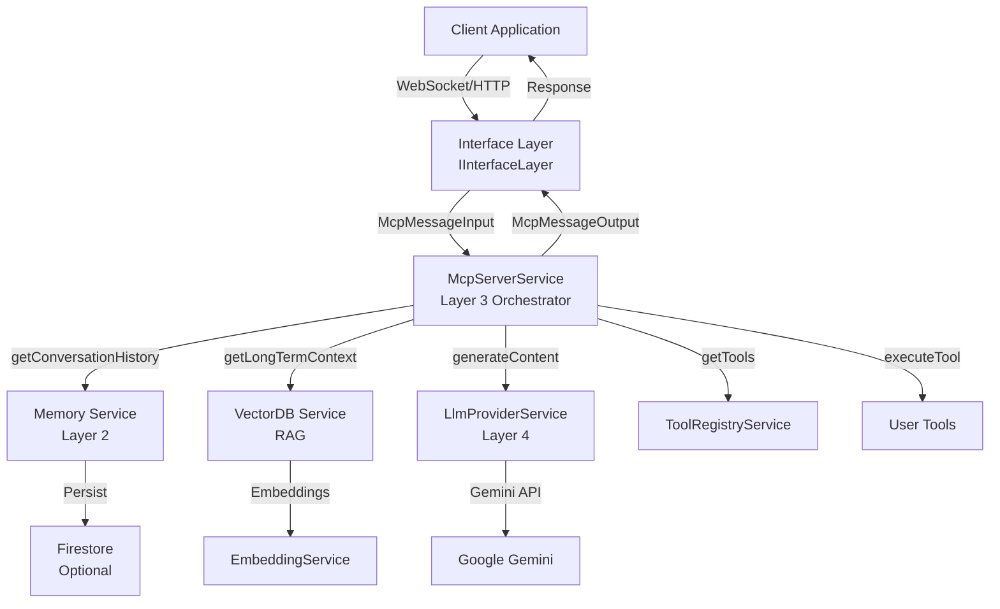

# EasyMCP Framework

A NestJS-based framework for building Model Context Protocol (MCP) servers with LLM integration, tool execution, and memory management.

## Description

EasyMCP simplifies the creation of MCP (Model Context Protocol) servers by providing a clean, layered architecture that handles:

- **LLM Integration**: Seamless integration with Google Gemini (extensible to other providers)
- **Tool Execution**: Automatic execution of tools when LLMs call them
- **Memory Management**: Short-term conversation history and long-term RAG (Retrieval-Augmented Generation)
- **Type Safety**: Full TypeScript support with comprehensive type definitions

## Installation

```bash
npm install easy-mcp-framework
# or
pnpm add easy-mcp-framework
# or
yarn add easy-mcp-framework
```

### Peer Dependencies

EasyMCP requires the following peer dependencies to be installed:

**Required:**
- `@nestjs/common` ^11.0.1
- `@nestjs/core` ^11.0.1
- `@nestjs/platform-express` ^11.0.1

**Optional (depending on your configuration):**
- `@google/genai` ^1.32.0 (required if using Gemini LLM provider)
- `firebase` ^12.6.0 (required if using Firestore for persistence)

Install them with:

```bash
npm install @nestjs/common@^11.0.1 @nestjs/core@^11.0.1 @nestjs/platform-express@^11.0.1
npm install @google/genai@^1.32.0  # If using Gemini
npm install firebase@^12.6.0        # If using Firestore
```

## Quick Start

```typescript
import { EasyMCP, McpConfig } from 'easy-mcp-framework';

// Define your tools
async function getUser(args: { userId: string }): Promise<string> {
  // Your tool logic here
  const user = await fetchUser(args.userId);
  return JSON.stringify(user);
}

// Configure EasyMCP
const config: McpConfig = {
  persistence: {
    type: 'FIRESTORE',
    appId: 'my-app',
    authToken: process.env.FIREBASE_AUTH_TOKEN,
    config: { /* Firebase config */ },
  },
  llmProvider: {
    model: 'gemini-1.5-flash',
    apiKey: process.env.GOOGLE_API_KEY,
    systemInstruction: 'You are a helpful assistant.',
  },
  ltmConfig: {
    vectorDB: {
      type: 'VECTOR_DB_SERVICE',
      endpoint: 'https://your-vectordb.com',
      collectionName: 'documents',
    },
    retrievalK: 3,
  },
  tools: [
    {
      name: 'getUser',
      description: 'Retrieves user details by ID',
      function: getUser,
      inputSchema: {
        type: 'OBJECT',
        properties: {
          userId: {
            type: 'STRING',
            description: 'The unique ID of the user',
          },
        },
        required: ['userId'],
      },
    },
  ],
};

// Initialize and run
async function bootstrap() {
  await EasyMCP.initialize(config);
  await EasyMCP.run();
}

bootstrap();
```

## Configuration

### McpConfig

The main configuration object passed to `EasyMCP.initialize()`:

```typescript
interface McpConfig {
  persistence: PersistenceConfig;
  llmProvider: LlmProviderConfig;
  ltmConfig: LTMConfig;
  tools: ToolRegistrationInput[];
}
```

### PersistenceConfig

Configuration for short-term memory (conversation history):

```typescript
interface PersistenceConfig {
  type: 'FIRESTORE';
  appId: string;
  authToken: string | null;
  config: any; // Firebase configuration object
}
```

### LlmProviderConfig

Configuration for the LLM provider:

```typescript
interface LlmProviderConfig {
  model: string; // e.g., 'gemini-1.5-flash'
  apiKey: string;
  systemInstruction: string;
}
```

### LTMConfig

Configuration for long-term memory (RAG):

```typescript
interface LTMConfig {
  vectorDB: {
    type: string;
    endpoint: string;
    collectionName: string;
  };
  retrievalK: number; // Number of documents to retrieve
}
```

## Tool Registration

Tools are automatically registered when passed in the `config.tools` array. Each tool must implement:

```typescript
interface ToolRegistrationInput {
  name: string;
  description: string;
  function: (args: Record<string, any>) => Promise<any>;
  inputSchema: {
    type: 'OBJECT';
    properties: Record<string, {
      type: 'STRING' | 'NUMBER' | 'INTEGER' | 'BOOLEAN' | 'ARRAY' | 'OBJECT';
      description: string;
      enum?: string[];
    }>;
    required?: string[];
  };
}
```

### Example Tool

```typescript
async function searchDatabase(args: { query: string; limit?: number }): Promise<string> {
  const results = await db.search(args.query, args.limit || 10);
  return JSON.stringify(results);
}

const searchTool: ToolRegistrationInput = {
  name: 'searchDatabase',
  description: 'Searches the database for matching records',
  function: searchDatabase,
  inputSchema: {
    type: 'OBJECT',
    properties: {
      query: {
        type: 'STRING',
        description: 'The search query',
      },
      limit: {
        type: 'INTEGER',
        description: 'Maximum number of results to return',
      },
    },
    required: ['query'],
  },
};
```

## API Reference

### EasyMCP Class

#### `static initialize(config: McpConfig): Promise<void>`

Initializes the EasyMCP framework with the provided configuration. Must be called before `run()`.

#### `static run(): Promise<void>`

Starts the EasyMCP server and begins listening for messages.

#### `static getService<T>(token: string | symbol): T`

Retrieves a service from the NestJS application context. Useful for advanced use cases.

#### `static shutdown(): Promise<void>`

Gracefully shuts down the EasyMCP framework, closing the NestJS application context and cleaning up resources. Should be called when the application is terminating (e.g., on SIGTERM, SIGINT signals).

```typescript
// Example: Handle graceful shutdown
process.on('SIGTERM', async () => {
  await EasyMCP.shutdown();
  process.exit(0);
});

process.on('SIGINT', async () => {
  await EasyMCP.shutdown();
  process.exit(0);
});
```

### Types

- `McpConfig` - Main configuration interface
- `ToolRegistrationInput` - Tool definition interface
- `McpMessageInput` - Input message format
- `McpMessageOutput` - Output message format
- `ConversationTurn` - Conversation history turn
- `IMemoryService` - Memory service interface
- `IInterfaceLayer` - Interface layer interface
- `ILlmClient` - LLM client interface

## Architecture

EasyMCP uses a 4-layer architecture:

1. **Interface Layer**: Handles communication (WebSockets, HTTP, etc.)
2. **Memory Layer**: Manages short-term (conversation) and long-term (vector DB) memory
3. **Abstraction Layer**: Core orchestration logic
4. **Provider Layer**: Connects to LLMs (Google Gemini)

### Architecture Diagram



### Interface Layer Implementation

**Important**: The framework includes a mock `WebSocketGatewayService` for development and testing. For production use, you have two options:

#### Option 1: Implement Your Own Interface Layer

You must implement the `IInterfaceLayer` interface to handle actual client connections:

```typescript
import { IInterfaceLayer, McpMessageOutput } from 'easy-mcp-framework';
import { McpServerService } from 'easy-mcp-framework';

class MyWebSocketInterface implements IInterfaceLayer {
  private mcpServer: McpServerService;

  constructor(mcpServer: McpServerService) {
    this.mcpServer = mcpServer;
  }

  async start(): Promise<void> {
    // Initialize your WebSocket server, HTTP server, or other transport
    // Listen for incoming messages and call this.mcpServer.handleMessage()
  }

  async sendMessage(sessionId: string, output: McpMessageOutput): Promise<void> {
    // Send the response back to the client
  }
}
```

Then register it in your NestJS module:

```typescript
import { INTERFACE_LAYER_TOKEN } from 'easy-mcp-framework';

// In your module providers:
{
  provide: INTERFACE_LAYER_TOKEN,
  useClass: MyWebSocketInterface,
}
```

#### Option 2: Use the Provided Mock (Development Only)

The framework includes `WebSocketGatewayService` which logs messages to console. This is suitable for development and testing but **not for production**.

**Note**: The mock service automatically sends a test message when `start()` is called. This is intentional for testing purposes.

## Examples

### Basic Chat Bot

```typescript
import { EasyMCP, McpConfig } from 'easy-mcp-framework';

const config: McpConfig = {
  // ... configuration
  tools: [], // No tools needed for basic chat
};

await EasyMCP.initialize(config);
await EasyMCP.run();
```

### Tool-Enabled Assistant

```typescript
// Define tools that interact with your application
const tools = [
  createUserTool,
  updateUserTool,
  deleteUserTool,
  // ... more tools
];

const config: McpConfig = {
  // ... configuration
  tools,
};

await EasyMCP.initialize(config);
await EasyMCP.run();
```

## Error Handling

EasyMCP provides custom error classes for better error handling:

- `EasyMcpError` - Base error class for all framework errors
- `ConfigurationError` - Configuration validation errors
- `ToolExecutionError` - Tool execution failures
- `ToolNotFoundError` - Tool not found in registry

### Error Handling Examples

```typescript
import { EasyMCP, ConfigurationError, ToolExecutionError, ToolNotFoundError } from 'easy-mcp-framework';

try {
  await EasyMCP.initialize(config);
} catch (error) {
  if (error instanceof ConfigurationError) {
    console.error('Configuration error:', error.message);
    // Handle configuration issues
  } else {
    console.error('Unexpected error:', error);
  }
}

// When calling tools programmatically
try {
  const toolRegistry = EasyMCP.getService<ToolRegistryService>(ToolRegistryService);
  const result = await toolRegistry.executeTool('myTool', { arg: 'value' });
} catch (error) {
  if (error instanceof ToolNotFoundError) {
    console.error('Tool not found:', error.message);
  } else if (error instanceof ToolExecutionError) {
    console.error('Tool execution failed:', error.message);
    console.error('Original error:', error.originalError);
  }
}
```

### Common Error Scenarios

1. **ConfigurationError**: Invalid or missing configuration fields
   - Check that all required fields are present
   - Verify API keys are correct
   - Ensure tool schemas are valid

2. **ToolNotFoundError**: Tool not registered or name mismatch
   - Verify tool is in `config.tools` array
   - Check tool name spelling matches exactly

3. **ToolExecutionError**: Tool function threw an error
   - Check the `originalError` property for details
   - Verify tool function handles all edge cases
   - Ensure tool returns a value (not undefined)

## Troubleshooting

### VectorDB Not Returning Results

If `getLongTermContext()` returns empty arrays:

1. **Check VectorDB Configuration**: Verify `ltmConfig.vectorDB.endpoint` and `collectionName` are correct
2. **Verify VectorDB Service**: Ensure your VectorDB endpoint is accessible and responding
3. **Check Embedding Service**: VectorDB requires EmbeddingService from ProvidersModule
4. **Review Logs**: Check console for VectorDB connection and retrieval errors

### Firestore Not Persisting Data

If conversation history is lost on restart:

1. **Verify Persistence Type**: Ensure `config.persistence.type === 'FIRESTORE'`
2. **Check Firebase Config**: Verify `config.persistence.config` contains valid Firebase configuration
3. **Firebase Initialization**: Ensure Firebase is properly initialized (check console logs)
4. **Permissions**: Verify Firestore security rules allow read/write operations

### Tools Not Executing

If tools are registered but not being called:

1. **Check Tool Registration**: Verify tools appear in console log during initialization
2. **Tool Schema**: Ensure `inputSchema` matches what the LLM expects
3. **Tool Description**: Make tool descriptions clear so LLM knows when to use them
4. **LLM Response**: Check if LLM is returning `toolCall` in response (may need better prompts)

### Interface Layer Not Working

If messages aren't being received:

1. **Implement IInterfaceLayer**: The default WebSocketGatewayService is a mock - implement your own
2. **Check Service Registration**: Ensure your interface layer is registered with `INTERFACE_LAYER_TOKEN`
3. **Message Format**: Verify messages match `McpMessageInput` interface
4. **Session IDs**: Ensure each client has a unique session ID

### Build/Import Issues

If you encounter TypeScript or import errors:

1. **Peer Dependencies**: Ensure all peer dependencies are installed (see Installation section)
2. **Type Exports**: Verify you're importing from the main package: `import { EasyMCP } from 'easy-mcp-framework'`
3. **Build Output**: Check that `dist/index.js` and `dist/index.d.ts` exist after building
4. **Module Resolution**: Ensure your `tsconfig.json` has proper module resolution settings

## Contributing

Contributions are welcome! Please feel free to submit a Pull Request.

## License

MIT License - see [LICENSE](LICENSE) file for details.

## Support

For issues and questions, please open an issue on [GitHub](https://github.com/nirarazi/easy-mcp).
