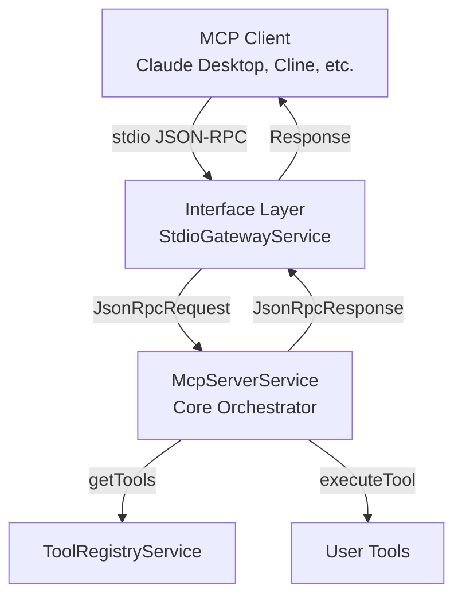

# EasyMCP Framework

A NestJS-based framework for building standard Model Context Protocol (MCP) servers with tool execution via JSON-RPC 2.0.

## Description

EasyMCP simplifies the creation of MCP (Model Context Protocol) servers by providing a clean, type-safe framework that:

- **Standard MCP Protocol**: Implements the Model Context Protocol specification with JSON-RPC 2.0 over stdio
- **Tool Execution**: Register and execute tools that external LLM agents can discover and call
- **Type Safety**: Full TypeScript support with comprehensive type definitions
- **Simple Configuration**: Minimal setup required - just define your tools and run

## Installation

```bash
npm install easy-mcp-framework
# or
pnpm add easy-mcp-framework
# or
yarn add easy-mcp-framework
```

### Peer Dependencies

EasyMCP requires the following peer dependencies to be installed:

- `@nestjs/common` ^11.0.1
- `@nestjs/core` ^11.0.1
- `@nestjs/platform-express` ^11.0.1

Install them with:

```bash
npm install @nestjs/common@^11.0.1 @nestjs/core@^11.0.1 @nestjs/platform-express@^11.0.1
```

## Quick Start

```typescript
import { EasyMCP, McpConfig } from 'easy-mcp-framework';

// Define your tools
async function getUser(args: { userId: string }): Promise<string> {
  // Your tool logic here
  const user = await fetchUser(args.userId);
  return JSON.stringify(user);
}

// Configure EasyMCP
const config: McpConfig = {
  tools: [
    {
      name: 'getUser',
      description: 'Retrieves user details by ID',
      function: getUser,
      inputSchema: {
        type: 'OBJECT',
        properties: {
          userId: {
            type: 'STRING',
            description: 'The unique ID of the user',
          },
        },
        required: ['userId'],
      },
    },
  ],
};

// Initialize and run
async function bootstrap() {
  await EasyMCP.initialize(config);
  await EasyMCP.run();
}

bootstrap();
```

## Configuration

### McpConfig

The main configuration object passed to `EasyMCP.initialize()`:

```typescript
interface McpConfig {
  tools: ToolRegistrationInput[];
  serverInfo?: ServerInfo;
}
```

### ToolRegistrationInput

Each tool must implement:

```typescript
interface ToolRegistrationInput {
  name: string;
  description: string;
  function: (args: Record<string, any>) => Promise<any>;
  inputSchema: {
    type: 'OBJECT';
    properties: Record<string, {
      type: 'STRING' | 'NUMBER' | 'INTEGER' | 'BOOLEAN' | 'ARRAY' | 'OBJECT';
      description: string;
      enum?: string[];
    }>;
    required?: string[];
  };
}
```

### ServerInfo (Optional)

Optional server information for MCP initialize response:

```typescript
interface ServerInfo {
  name: string;
  version: string;
}
```

### Example Tool

```typescript
async function searchDatabase(args: { query: string; limit?: number }): Promise<string> {
  const results = await db.search(args.query, args.limit || 10);
  return JSON.stringify(results);
}

const searchTool: ToolRegistrationInput = {
  name: 'searchDatabase',
  description: 'Searches the database for matching records',
  function: searchDatabase,
  inputSchema: {
    type: 'OBJECT',
    properties: {
      query: {
        type: 'STRING',
        description: 'The search query',
      },
      limit: {
        type: 'INTEGER',
        description: 'Maximum number of results to return',
      },
    },
    required: ['query'],
  },
};
```

## API Reference

### EasyMCP Class

#### `static initialize(config: McpConfig): Promise<void>`

Initializes the EasyMCP framework with the provided configuration. Must be called before `run()`.

#### `static run(): Promise<void>`

Starts the EasyMCP server and begins listening for JSON-RPC requests via stdio.

#### `static getService<T>(token: string | symbol): T`

Retrieves a service from the NestJS application context. Useful for advanced use cases.

#### `static shutdown(): Promise<void>`

Gracefully shuts down the EasyMCP framework, closing the NestJS application context and cleaning up resources. Should be called when the application is terminating (e.g., on SIGTERM, SIGINT signals).

```typescript
// Example: Handle graceful shutdown
process.on('SIGTERM', async () => {
  await EasyMCP.shutdown();
  process.exit(0);
});

process.on('SIGINT', async () => {
  await EasyMCP.shutdown();
  process.exit(0);
});
```

### Types

- `McpConfig` - Main configuration interface
- `ToolRegistrationInput` - Tool definition interface
- `ServerInfo` - Optional server information
- `JsonRpcRequest`, `JsonRpcResponse` - JSON-RPC 2.0 types
- `InitializeParams`, `InitializeResult` - MCP initialize types
- `ListToolsResult`, `McpTool` - MCP tools types
- `CallToolParams`, `CallToolResult` - MCP tool call types
- `ToolDefinition`, `ToolParameter`, `ToolFunction` - Tool interfaces
- `IInterfaceLayer` - Interface layer interface

## Architecture

EasyMCP uses a simplified architecture for standard MCP servers:

1. **Interface Layer**: Handles JSON-RPC 2.0 communication over stdio
2. **Core Layer**: Implements MCP protocol methods (initialize, tools/list, tools/call)
3. **Tool Registry**: Manages tool registration and execution

### Architecture Diagram



## MCP Protocol

EasyMCP implements the standard Model Context Protocol specification:

### Supported Methods

- `initialize` - Server/client handshake, returns server capabilities
- `tools/list` - Returns all registered tools with their schemas
- `tools/call` - Executes a tool with provided arguments and returns the result

### Transport

The server communicates via JSON-RPC 2.0 over stdio (standard input/output), which is the standard transport for MCP servers. This allows the server to be used with MCP clients like Claude Desktop, Cline, and other MCP-compatible tools.

## Error Handling

EasyMCP provides custom error classes for better error handling:

- `EasyMcpError` - Base error class for all framework errors
- `ConfigurationError` - Configuration validation errors
- `ToolExecutionError` - Tool execution failures
- `ToolNotFoundError` - Tool not found in registry

### Error Handling Examples

```typescript
import { 
  EasyMCP, 
  ConfigurationError, 
  ToolExecutionError, 
  ToolNotFoundError
} from 'easy-mcp-framework';

// Configuration errors
try {
  await EasyMCP.initialize(config);
} catch (error) {
  if (error instanceof ConfigurationError) {
    console.error('Configuration error:', error.message);
  }
}

// Tool execution errors (handled automatically by MCP protocol)
// Tools that throw errors will return error responses in the MCP format
```

## Troubleshooting

### Tools Not Executing

If tools are registered but not being called:

1. **Check Tool Registration**: Verify tools appear in console log during initialization
2. **Tool Schema**: Ensure `inputSchema` matches JSON Schema format
3. **Tool Description**: Make tool descriptions clear so LLM agents know when to use them
4. **MCP Client**: Verify your MCP client (Claude Desktop, etc.) is properly configured

### Build/Import Issues

If you encounter TypeScript or import errors:

1. **Peer Dependencies**: Ensure all peer dependencies are installed (see Installation section)
2. **Type Exports**: Verify you're importing from the main package: `import { EasyMCP } from 'easy-mcp-framework'`
3. **Build Output**: Check that `dist/index.js` and `dist/index.d.ts` exist after building
4. **Module Resolution**: Ensure your `tsconfig.json` has proper module resolution settings

## Examples

See the `examples/` directory for complete working examples.

## Contributing

Contributions are welcome! Please feel free to submit a Pull Request.

## License

MIT License - see [LICENSE](LICENSE) file for details.

## Support

For issues and questions, please open an issue on [GitHub](https://github.com/nirarazi/easy-mcp).
